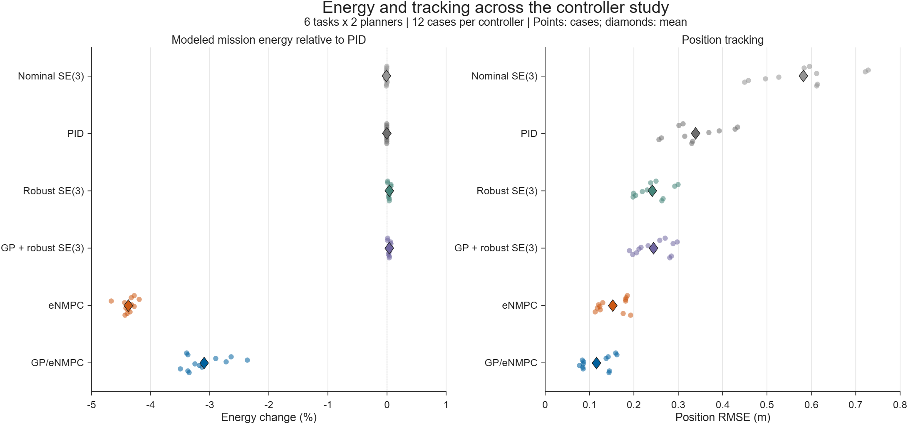
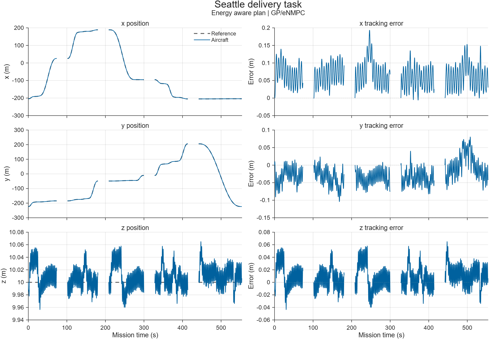
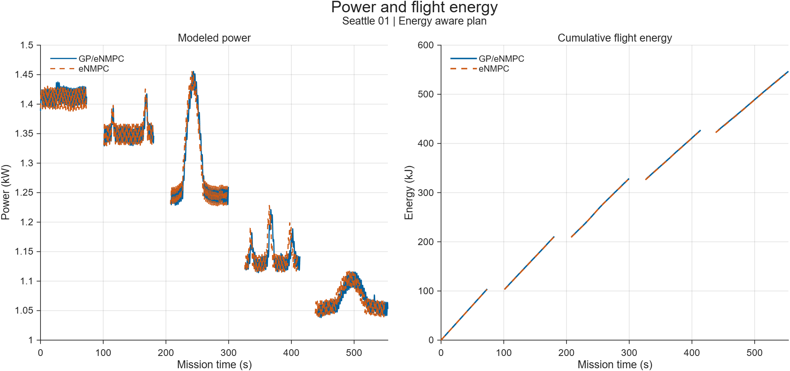
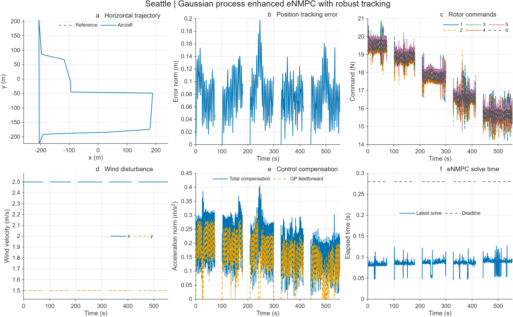

# Numerical study results

The study contains 72 controller comparisons, 12 payload cases and 12
event-replanning cases. All 96 tasks reached completion; 70 satisfied every
performance criterion.

## Controller comparison



The six controllers share 12 task and planning configurations: two delivery
tasks in each of Cambridge, Seattle and Manhattan, each with a distance plan
and an energy aware plan. Points show individual configurations; diamonds
show arithmetic means. Mission energy includes flight and delivery service,
and is normalized to PID within each configuration in the left panel.

| Controller | Mean mission energy (kJ) | Mean position RMSE (m) | Cases meeting all performance criteria |
| --- | ---: | ---: | ---: |
| Nominal SE(3) | 828.556 | 0.5819 | 12/12 |
| PID | 828.632 | 0.3393 | 12/12 |
| Robust SE(3) | 828.963 | 0.2418 | 12/12 |
| GP + robust SE(3) | 828.947 | 0.2444 | 12/12 |
| eNMPC | 792.355 | 0.1523 | 10/12 |
| GP/eNMPC | 803.180 | 0.1161 | 6/12 |

GP/eNMPC reduces position RMSE by 24.89% relative to eNMPC, with 1.34% higher
modeled mission energy. Relative to PID, the reductions are 65.23% in position
RMSE and 3.10% in modeled mission energy. These percentages are calculated
within each matched configuration and then averaged over the 12 configurations.

The full tables also report motion smoothness, rotor commands, computation
time and performance criteria. [Vector figure](../docs/images/controller-comparison.pdf).

## Seattle flight example

Seattle 01 with the energy aware plan illustrates the response over five
flight legs and four deliveries. The position reference uses Cartesian
coordinates with the vertical axis pointing upwards and a cruise height of
10 m. Gaps between flight legs mark the delivery-service intervals.

### Three-axis tracking



The left column compares the reference and GP/eNMPC aircraft position; the
right column shows aircraft position minus reference for each axis. The
three-dimensional position RMSE for this flight is 0.0861 m.
[Vector figure](../docs/images/seattle-tracking.pdf).

### Power and energy



Power is evaluated with the vehicle energy model. Cumulative flight energy
integrates power separately over each recorded flight leg. Delivery-service
energy is included in the mission totals below; the time-series curves show
the flight portions.

| Quantity | GP/eNMPC | eNMPC |
| --- | ---: | ---: |
| Position RMSE (m) | 0.0861 | 0.1134 |
| Flight energy (kJ) | 546.688 | 540.901 |
| Delivery-service energy (kJ) | 107.758 | 107.758 |
| Mission energy (kJ) | 654.446 | 648.659 |

This example shows the improved overall tracking accuracy and slightly higher
energy consumption of GP/eNMPC relative to eNMPC.
[Vector figure](../docs/images/seattle-energy.pdf).

### Trajectory and control response



The six panels show the horizontal flight path, position-error norm, six
rotor-force commands, wind, acceleration compensation and eNMPC computation
time for the same GP/eNMPC task.

## Tables

| File | Contents |
| --- | --- |
| `case_metrics.csv` | Per-case completion, performance criteria and metrics |
| `method_summary.csv` | Summary by controller and experiment group |
| `controller_comparisons.csv`, `controller_pairs.csv` | Paired controller comparisons |
| `payload_comparisons.csv`, `payload_pairs.csv` | Dynamic-payload experiments |
| `replanning_comparisons.csv`, `replanning_pairs.csv` | Event-replanning experiments |

Metrics include modeled energy, flight and service duration, tracking error,
acceleration, jerk, compensation, rotor-command variation and computation time.

## Plotting and simulation

Recreate the controller-comparison figure from the supplied tables in MATLAB:

```matlab
addpath("results")
plot_results
```

PNG and vector PDF files are written to `outputs/study_figures`. To select a
destination, call `plot_results(outputDirectory)`.

Flight plots can also be drawn with `plot_results(outputDirectory, series)`.
`series` is a two-element structure array containing the GP/eNMPC and eNMPC
flights in that order. Each element has `method`, `time_s`, `leg_index`,
`position_m`, `reference_position_m`, `power_w` and `flight_energy_j` fields.
The plotting function preserves flight-leg boundaries in the curves and
energy integration.

Generate a new Seattle simulation and its response figure with:

```matlab
[trace, result, folder] = main("seattle_01", "energy");
view_result(fullfile(folder, "simulation.mat"));
```

A saved simulation contains the complete trace in `simulation.mat`.
